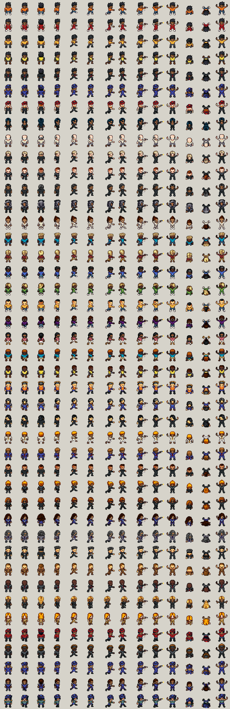

# Game character sheets

48 × 48 character sheets for the whole cast in the character sprite brief:
6 Stretch outfits, 4 syndicate lieutenants and 33 street NPC looks. They are
built from Universal LPC art by the bundled
[character generator](../character-generator).

- `sheets/<id>.png`: one sheet per character, 25 × 7 frames of 48 × 48.
- `sheets/manifest.json`: where every animation sits (row, start frame,
  frame count, view), plus each character's archetypes, description and
  LPC selections.
- `sheets/CREDITS.txt` and `sheets/CREDITS.csv`: the art credits (required,
  see below).
- `preview/contact.png`: key frames of every character, one row each.
- `viewer.html`: animated preview of any animation for the whole cast. Run
  `npm run serve`, then open http://localhost:8091.



## Frame format

Matches the brief's §1:

- 48 × 48 frames on a transparent background.
- Soles on row 43 in every standing and walking frame, centred at x ≈ 23–24.
- Hips around row 32.
- Front, back and side views, with the side facing right. Mirror it for
  left; nothing in the art is side-specific.
- LPC's own dark outline and shading.

LPC art is drawn on a 64 px frame. It is scaled by 3/4 with a filter that
keeps the dark outlines, so a character stands about 36–38 px tall.

**Row 0 keeps the current 20-frame layout exactly** (§3), so frames 0–19
drop straight in. Frame numbers stay the same even though the sheet is now
wider.

## Animations

Every character has the same layout. Rows 1–6 follow the brief's §5
suggestion:

| Row | Contents |
|---|---|
| 0 | idle F, walk F ×4, idle B, walk B ×4, idle S, walk S ×4, hands up, cower, punch, hurt, KO (current layout) |
| 1 | smooth walks: front ×8, back ×8, side ×8 |
| 2 | runs (sprint, flee, chase, jog): front ×8, back ×8, side ×8 |
| 3 | side fist fighting: stance ×2, jab ×3, cross ×3, heavy finisher ×4, lunge ×2 |
| 4 | side weapons: knife slash ×4, knife stab ×4, pistol aim + fire ×4 (muzzle flash on the 3rd), point / "Freeze!" ×2 |
| 5 | reactions (front): hurt ×2, stagger ×4, knocked down ×4, get up ×4, KO ×2, restrained ×2 |
| 6 | breathing idles F/B/S ×2, fight stance F ×2, taunt ×2, kneel / search ×2, sit F, sit S, jump / dodge S ×5, climb ×6 |

The exact positions are in `sheets/manifest.json` under `animations`, for
example `"punch_jab": { "row": 3, "start": 2, "count": 3, "view": "S" }`.

**Stand-in frames.** An LPC item has no art for some poses. Where a
character wears one, the affected animation uses stand-in frames instead of
showing the item vanishing, and `manifest.json` lists it under that
character's `fallbacks`:

- Neckties and bow ties have no climbing art, so suits climb using walk
  frames.
- The black gown and the silk scarf have no fighting art, and the gown has
  no running art. Those two socialites use walk and slash frames there.

Everyone else has every animation.

### What LPC can't provide

These items from the brief have no LPC art, so they aren't in the sheets:

- **Missing weapons and props:** baseball bat, taser, phone, radio,
  binoculars, fake badge, brass-knuckle glint, carried items (bags,
  briefcase, camera). The pistol on the aim frames is a small sprite drawn
  by the build script.
- **Missing views:** hurt, stagger and knockdown exist only facing the
  camera. Front and back views of punches and weapons aren't included; LPC
  has them, so I can add them if needed.
- **Missing poses:** riding a bike, the car break-in and hot-wire, dumpster
  hop, chokehold, zip-tie, pickpocket, bump, change outfit, hide in
  doorway, arrest/cuff, the boss intro and defeat poses, winded (hands on
  knees), get on and off a bike, and the heavy-bag workout.
- **Look compromises:** Rourke has no muscular build, because the LPC
  muscular body has no art for most shirts. The cap is LPC's flat
  "Bonnie" cap. Marchetti wears a black pantsuit instead of a gown, so she
  keeps her run and fight animations.

## How the looks were chosen

Fixed choices come from the brief: names, roles, outfits ("big bruiser, red
cap" and so on), and Stretch's brown skin, spiky black hair and smug
half-lidded look. Anything the brief leaves open is picked at random with a
seed of the character id, so it is varied but stable between rebuilds. That
covers skin tone, hair style and colour, and eye colour.

Each archetype has at least three looks, and the three cops are distinct
characters rather than recolours. `worker_orange` and `worker_overalls` are
new: the night-shift worker had only one look before.

| Sheet | Archetypes | Look | Stand-ins |
|---|---|---|---|
| `stretch` | player | Hoodie: orange zip jacket, dark jeans, white sneakers | — |
| `stretch_track` | player | Tracksuit: matching red tracksuit with white stripes | — |
| `stretch_courier` | player | Courier: yellow courier jacket and black cap | — |
| `stretch_worker` | player | Night-shift worker: hi-vis vest over a dark long-sleeve, work boots | — |
| `stretch_suit` | player | Suit: slick black suit and red tie | climb |
| `stretch_scpf` | player | SCPF disguise: navy police uniform, cap and gold epaulets | — |
| `lt_rourke` | lieutenant | "Knuckles" Rourke: big bruiser, red cap, brass knuckles | — |
| `lt_marchetti` | lieutenant | Vee Marchetti: elegant and dangerous, sleek all-black pantsuit, shades | — |
| `lt_hallorann` | lieutenant | "Doc" Hallorann: gaunt warehouse chemist in a pale lab coat and glasses | — |
| `lt_crane` | lieutenant | Silas Crane: the final boss. Tuxedo, silver hair, silver beard | climb |
| `turtleneck` | local, corner dealer | Charcoal turtleneck, dark trousers | — |
| `blackfit` | local, Crane thug | All-black streetwear | — |
| `dark_layers` | local, Crane thug, corner dealer | Dark layered cardigan with the hood up | — |
| `mono_fit` | local, socialite | Monochrome cream outfit | — |
| `local_teal` | local | Teal T-shirt, jeans | — |
| `local_maroon` | local | Maroon long-sleeve, khakis | — |
| `street_blue` | student, jogger | Blue streetwear, sneakers | — |
| `tracksuit_lime` | student, jogger | Lime tracksuit | — |
| `jacket_yellow` | student, tourist | Yellow jacket, jeans | — |
| `student_purple` | student | Purple sweater, glasses | — |
| `tourist_pink` | tourist, jogger | Pink polo, white shorts, sunglasses | — |
| `tourist_teal` | tourist | Teal polo, khaki shorts, sunglasses | — |
| `worker_hivis` | worker | Yellow hi-vis vest, work boots | — |
| `worker_orange` | worker | Orange hi-vis vest, dark bandana | — |
| `worker_overalls` | worker | Work overalls, beard | — |
| `suit_slick` | office suit | Slick black suit, swept-back hair | climb |
| `suit_pale` | office suit | Pale cream suit | climb |
| `suit_classic` | office suit | Classic navy suit, red tie | climb |
| `suit_tux` | office suit | Black tuxedo, bow tie | climb |
| `tux_dark` | office suit | Charcoal tuxedo, bow tie, female | climb |
| `suit_sharp` | office suit, socialite | Sharp black suit, shades | — |
| `suit_navy` | office suit | Navy suit, blue tie | climb |
| `suit_grey` | office suit | Grey suit, glasses | climb |
| `suit_black` | office suit | Black suit, white shirt look | climb |
| `suit_brown` | office suit | Brown suit, mustache | climb |
| `suit_bald` | office suit | Charcoal suit, bald | climb |
| `gown_black` | socialite | Black evening gown | runs, fighting, taunt, sit, jump, climb |
| `suit_scarf` | socialite | Camel suit with a silk scarf | fighting, climb |
| `jacket_red_cap` | Crane thug | Red jacket, red cap | — |
| `techwear` | Crane thug, corner dealer | Black techwear, shades, bandana | — |
| `cop_a` | SCPF officer | Officer: navy uniform, cap, epaulets | — |
| `cop_b` | SCPF officer | Officer: short-sleeve uniform, ponytail | — |
| `cop_c` | SCPF officer | Sergeant: heavier build, mustache, cap | — |

## Rebuilding or changing a look

Edit `characters.mjs`, then:

```sh
cd ../character-generator && npm ci && npm run build   # once
cd ../character-sheets
npm install
npx playwright install chromium   # once, if Playwright has no browser yet
npm run export   # LPC sheets into lpc/ (checks every item resolves exactly)
npm run build    # 48x48 sheets, manifest, credits, contact sheet
```

To change a single character, run `npm run export -- --only lt_rourke`, then
`npm run build`. Each character's `lpc` selections in the manifest are the
generator's URL hash, so you can paste them after `#` in the generator to
open that look and tweak it by hand.

## Credits and licences

The art is LPC art under CC-BY-SA 3.0, GPL 3.0, OGA-BY 3.0, CC-BY 3.0 and
CC0; every file is under at least one of these. **You must credit the
authors.** `sheets/CREDITS.txt` lists every author and source, and
`sheets/CREDITS.csv` has per-file detail.

CC-BY-SA does not allow DRM. For a release on Steam or the App Store, see the
generator's licence notes in the root README.
